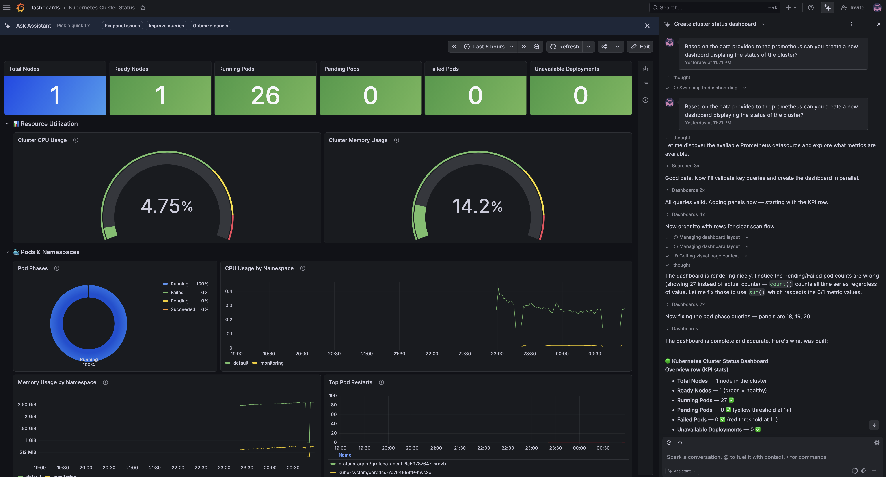
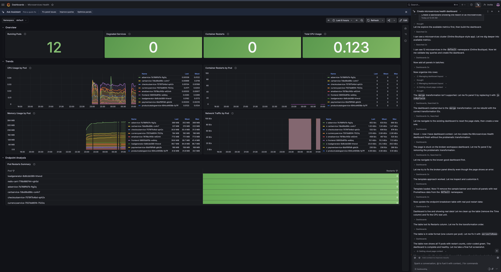
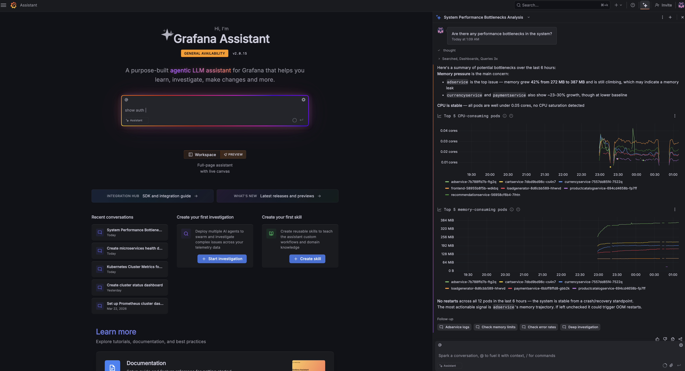
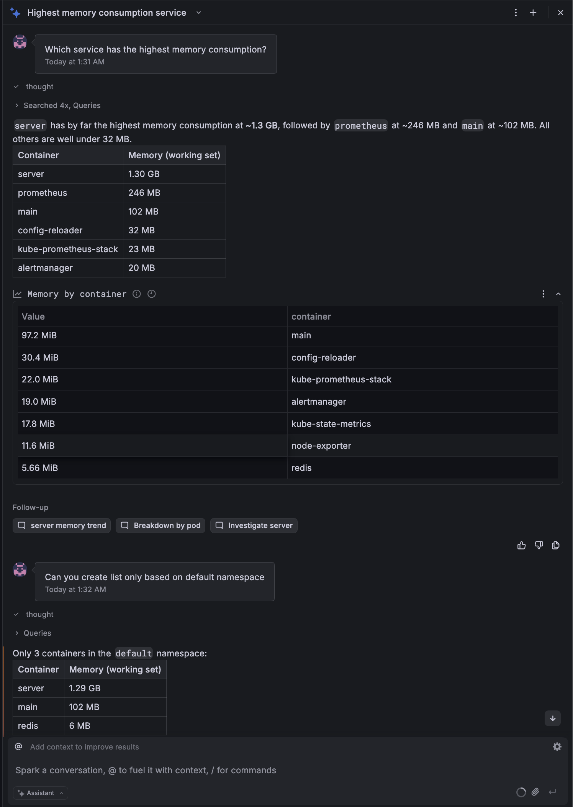

# Perf-A - Application Performance Analysis with Grafana Assistant

**Project Type:** 3 
**Project Number** 5 
**Year:** 2026  
**Group:** Czw 9:15

## Authors
- Rafał Chrzanowski
- Oktawiusz Doroszuk
- Maria Gajek
- Wojciech Wietrzny

## Contents
- [Perf-A - Application Performance Analysis with Grafana Assistant](#perf-a---application-performance-analysis-with-grafana-assistant)
  - [Authors](#authors)
  - [Contents](#contents)
  - [1. Introduction](#1-introduction)
    - [Architecture Overview](#architecture-overview)
  - [2. Theoretical Background/Technology Stack](#2-theoretical-backgroundtechnology-stack)
    - [Core Technologies](#core-technologies)
      - [Kubernetes (Kind)](#kubernetes-kind)
      - [Prometheus](#prometheus)
      - [Grafana Cloud](#grafana-cloud)
      - [Grafana Assistant](#grafana-assistant)
      - [Grafana Agent](#grafana-agent)
      - [Helm](#helm)
      - [Podman](#podman)
    - [Demo Application](#demo-application)
      - [Google Cloud Microservices Demo](#google-cloud-microservices-demo)
  - [3. Case Study Concept Description](#3-case-study-concept-description)
    - [Application](#application)
    - [Observability](#observability)
    - [Visualization](#visualization)
  - [4. Case Study High Level Architecture](#4-case-study-high-level-architecture)
  - [5. Case Study Detailed Architecture](#5-case-study-detailed-architecture)
    - [Component Interactions](#component-interactions)
    - [Data Flow](#data-flow)
  - [6. Environment Configuration Description](#6-environment-configuration-description)
    - [Prerequisites](#prerequisites)
      - [Required Tools](#required-tools)
      - [System Requirements](#system-requirements)
    - [Configuration Files](#configuration-files)
      - [`.env` File](#env-file)
    - [Grafana Cloud Setup](#grafana-cloud-setup)
      - [Step 1: Create Grafana Cloud Account](#step-1-create-grafana-cloud-account)
      - [Step 2: Create a Stack](#step-2-create-a-stack)
      - [Step 3: Get Prometheus Remote Write Credentials](#step-3-get-prometheus-remote-write-credentials)
      - [Step 4: Create Metrics API Token](#step-4-create-metrics-api-token)
      - [Step 5: Configure `.env` File](#step-5-configure-env-file)
  - [7. Installation Method](#7-installation-method)
    - [Quick Start](#quick-start)
    - [What Gets Installed](#what-gets-installed)
  - [8. Demo Deployment Steps](#8-demo-deployment-steps)
    - [a. Configuration Set-up](#a-configuration-set-up)
    - [b. Data Preparation](#b-data-preparation)
  - [9. Demo Description](#9-demo-description)
    - [a. Execution Procedure](#a-execution-procedure)
      - [Step 1: Access Grafana Cloud](#step-1-access-grafana-cloud)
      - [Step 2: Verify Metrics Connection](#step-2-verify-metrics-connection)
      - [Step 3: Use Grafana Assistant](#step-3-use-grafana-assistant)
      - [Example AI Prompts:](#example-ai-prompts)
      - [Where to Type Queries in Grafana Cloud](#where-to-type-queries-in-grafana-cloud)
    - [b. Results presentation](#b-results-presentation)
      - [1. **Create a dashboard showing Kubernetes cluster status**](#1-create-a-dashboard-showing-kubernetes-cluster-status)
      - [2. **Create a dashboard showing the health of all microservices**](#2-create-a-dashboard-showing-the-health-of-all-microservices)
      - [3. **Identify bottlenecks**](#3-identify-bottlenecks)
      - [4. **Service memory usage**](#4-service-memory-usage)
  - [10. Summary – Conclusions](#10-summary--conclusions)
  - [11. References](#11-references)
    - [Official Documentation](#official-documentation)
    - [Demo Application](#demo-application-1)
    - [Tutorials and Guides](#tutorials-and-guides)
  - [Quick Reference Commands](#quick-reference-commands)
    - [Cluster Management](#cluster-management)


---

## 1. Introduction

This project demonstrates the use of Grafana Assistant (AI-powered observability tool) to analyze and optimize application performance in a Kubernetes environment. The main objective is to demonstrate the use of Grafana Assistance to manage Grafana configurations and demonstrate application performance as well as the process of identifying application bottlenecks. 

The demo application is a microservices-based platform deployed on a local Kubernetes cluster (Kind), monitored by Prometheus. Metrics are pushed to Grafana Cloud where the Grafana Assistant provides AI-powered analysis and visualization.

### Architecture Overview

This project uses a hybrid cloud-local architecture:
- Local: Kubernetes cluster (KIND) with Prometheus and microservices
- Cloud: Grafana Cloud with AI Assistant for visualization
- Connection: Grafana Agent pushes metrics from local to cloud

---

## 2. Theoretical Background/Technology Stack

### Core Technologies

#### Kubernetes (Kind)
- Purpose: Container orchestration platform
- Why Kind: Lightweight local Kubernetes cluster for development and testing
- Documentation: https://kind.sigs.k8s.io/

#### Prometheus
- Purpose: Metrics collection and time-series database
- Why Prometheus: Easy integration with the microservice architecture
- Documentation: https://prometheus.io/docs/

#### Grafana Cloud
- Purpose: Cloud-based visualization and analytics platform
- Key Features:
  - Dashboard creation and management
  - Alert management
  - Data source integration
  - Grafana Assistant: AI-powered query and dashboard generation
- Why Cloud: Grafana Assistant is a cloud-exclusive feature
- Documentation: https://grafana.com/docs/

#### Grafana Assistant
- Purpose: AI-powered observability assistant
- Availability: Grafana Cloud only (not available in self-hosted Grafana)
- Requirements: 
  - Grafana Cloud account (free tier is enough)
  - Prometheus metrics pushed to cloud
- Documentation: 
  - Get Started: https://grafana.com/docs/grafana-cloud/machine-learning/assistant/get-started/
  - Grafana Cloud: https://grafana.com/docs/grafana-cloud/

#### Grafana Agent
- Purpose: Lightweight metrics collector and forwarder between local and cloud
- Role in Project: Federates selected metrics from the local Prometheus instance and pushes them to Grafana Cloud using remote write
- Metrics Scope:
  - Kubernetes cluster health and pod status metrics
  - Container CPU, memory, and network metrics for active namespaces
  - Node-level CPU, memory, and filesystem metrics
  - API server operational health metrics
  - Application gRPC and HTTP performance metrics from the demo microservices
- Deployment: Runs in a dedicated `grafana-agent` namespace as a Kubernetes Deployment with a ConfigMap-based configuration
- Documentation: https://grafana.com/docs/agent/

#### Helm
- Purpose: Kubernetes package manager
- Usage: Deploying Prometheus stack
- Documentation: https://helm.sh/docs/

#### Podman
- Purpose: Container runtime (Docker alternative)
- Why Podman: Rootless containers, better security, no need for Docker Desktop
- Documentation: https://podman.io/

### Demo Application

#### Google Cloud Microservices Demo
- Repository: https://github.com/GoogleCloudPlatform/microservices-demo
- Description: Cloud-native microservices application (Online Boutique)
- Why this demo: Includes load generation and Prometheus metrics

---

## 3. Case Study Concept Description

### Application
Online Boutique is a cloud-first microservices demo application. The application is a web-based e-commerce app where users can browse items, add them to the cart, and purchase them. It generates realistic traffic patterns and metrics suitable for performance analysis.

### Observability
The observability stack consists of:

1. Metrics Collection: Prometheus scrapes metrics from all Kubernetes pods and services locally
2. Data Forwarding: Grafana Agent forwards metrics to Grafana Cloud
3. Data Storage: Time-series data stored in Grafana Cloud Prometheus
4. Visualization: Grafana Cloud dashboards display metrics in real-time
5. AI Analysis: Grafana Assistant provides intelligent insights

Monitored Metrics:
- Microservice performance metrics, including gRPC handling duration and request counters
- HTTP request duration and total request metrics exposed by the application
- Container resource usage metrics for CPU, memory, and network activity
- Pod, deployment, namespace, and node health metrics from Kubernetes
- Node resource metrics such as CPU utilization, memory availability, and filesystem usage
- API server request and availability metrics

### Visualization

Grafana Cloud provides high range of possibilities for visualization and analysis of metrics. As the main goal is to integrate with the Grafana AI Assistant the visualization is only limited to the Grafana Cloud platform and data available via Prometheus.

---

## 4. Case Study High Level Architecture

```
┌─────────────────────────────────────────────────────────────┐
│                  Local Development Machine                  │
│                                                             │
│  ┌────────────────────────────────────────────────────────┐ │
│  │              Podman Container Runtime                  │ │
│  │                                                        │ │
│  │  ┌────────────────────────────────────────────────────┐│ │
│  │  │         Kind Kubernetes Cluster                    ││ │
│  │  │                                                    ││ │
│  │  │  ┌──────────────────────────────────────────────┐  ││ │
│  │  │  │  Monitoring Namespace                        │  ││ │
│  │  │  │  └─ Prometheus (metrics collection)          │  ││ │
│  │  │  │                                              │  ││ │
│  │  │  └──────────────────────────────────────────────┘  ││ │
│  │  │                                                    ││ │
│  │  │  ┌──────────────────────────────────────────────┐  ││ │
│  │  │  │  Grafana-Agent Namespace                     │  ││ │
│  │  │  │  └─ Grafana Agent (metrics forwarding)       │  ││ │
│  │  │  └──────────────────────────────────────────────┘  ││ │
│  │  │                                                    ││ │
│  │  │  ┌──────────────────────────────────────────────┐  ││ │
│  │  │  │  Perf-A Namespace                            │  ││ │
│  │  │  │  ├─ Frontend Service                         │  ││ │
│  │  │  │  ├─ Product Catalog Service                  │  ││ │
│  │  │  │  ├─ Cart Service                             │  ││ │
│  │  │  │  ├─ Checkout Service                         │  ││ │
│  │  │  │  ├─ Payment Service                          │  ││ │
│  │  │  │  ├─ Email Service                            │  ││ │
│  │  │  │  ├─ Shipping Service                         │  ││ │
│  │  │  │  ├─ Currency Service                         │  ││ │
│  │  │  │  ├─ Recommendation Service                   │  ││ │
│  │  │  │  ├─ Ad Service                               │  ││ │
│  │  │  │  └─ Load Generator                           │  ││ │
│  │  │  └──────────────────────────────────────────────┘  ││ │
│  │  └────────────────────────────────────────────────────┘│ │
│  └────────────────────────────────────────────────────────┘ │
└─────────────────────────────────────────────────────────────┘
                          ↓ HTTPS (Remote Write)
                          ↓
┌─────────────────────────────────────────────────────────────┐
│                      Grafana Cloud                          │
│                                                             │
│  ┌────────────────────────────────────────────────────────┐ │
│  │  Prometheus Storage (receives metrics)                 │ │
│  └────────────────────────────────────────────────────────┘ │
│                          ↓                                  │
│  ┌────────────────────────────────────────────────────────┐ │
│  │  Grafana Interface + AI Assistant                      │ │
│  │  ├─ Dashboards                                         │ │
│  │  ├─ Explore (query interface)                          │ │
│  │  └─ Grafana Assistant (AI-powered)                     │ │
│  └────────────────────────────────────────────────────────┘ │
│                                                             │
│  Access: https://[yourstack].grafana.net                    │
└─────────────────────────────────────────────────────────────┘
```

---

## 5. Case Study Detailed Architecture

### Component Interactions

```
```


### Data Flow

```
```

---

## 6. Environment Configuration Description

### Prerequisites

#### Required Tools
- Kind: v0.20.0+
- kubectl: v1.28.0+
- Helm: v3.12.0+
- Podman: v4.0.0+
- Bash: 4.0+
- `envsubst` (usually provided by GNU `gettext`)

#### System Requirements
- OS: macOS, Linux, or Windows (WSL2)
- CPU: 4+ cores recommended
- RAM: 8GB minimum, 16GB recommended
- Disk: 20GB free space
- Network: Internet connection required for Grafana Cloud

### Configuration Files

#### `.env` File
Create from `.env.example`:
```bash
cp .env.example .env
```

**Required variables:**

```bash
# Grafana Cloud Prometheus Configuration (Required)
# Get these from: Grafana Cloud → Connections → Hosted Prometheus metrics
# Example: https://prometheus-prod-xx-xxx.grafana.net/api/prom/push
GRAFANA_CLOUD_PROMETHEUS_URL=[REPLACE_PROMETHEUS_REMOTE_WRITE_URL]
GRAFANA_CLOUD_PROMETHEUS_USERNAME=[REPLACE_INSTANCE_ID]
# Create via: Administration → Access Policies → Create access policy with metrics:write scope
GRAFANA_CLOUD_PROMETHEUS_PASSWORD=[REPLACE_METRICS_API_TOKEN]

# Optional: OpenAI API Key (for enhanced AI features)
OPENAI_API_KEY=[REPLACE_OPENAI_API_KEY]
```

> [!CAUTION]
>  Never commit `.env` file to version control!
>  Never change the `.env.example` file!

---

### Grafana Cloud Setup 

Grafana Assistant is a Grafana Cloud exclusive feature. Follow these steps to set up your cloud account:

#### Step 1: Create Grafana Cloud Account

1. Go to: https://grafana.com/auth/sign-up/create-user
2. Sign up for a **free** Grafana Cloud account (or paid if you wish to use this solution more extensively or for a longer period of time)
3. Complete email verification

#### Step 2: Create a Stack

1. After login, you'll be prompted to create a stack
2. Choose a stack name (e.g., "perf-a-monitoring")
3. Select a region closest to you (e.g., EU West, US Central)
4. Select **"Free"** plan (includes Grafana Assistant)
5. Click "Create stack"
6. Wait 1-2 minutes for provisioning

#### Step 3: Get Prometheus Remote Write Credentials

1. In your Grafana Cloud portal, go to: **Connections** → **Add new connection**
2. Search for **"Hosted Prometheus metrics"**
3. Create a new connection.
4. Click on it to see your credentials:
   - **Remote Write Endpoint URL**: Copy this (e.g., `https://prometheus-prod-xx-xxx.grafana.net/api/prom/push`)
   - **Username/Instance ID**: Copy this number (e.g., `1234567`)

#### Step 4: Create Metrics API Token

1. Go to: **Administration** → **Access Policies**
2. Click **"Create access policy"**
3. Configure:
   - **Display name**: "metrics-publisher"
   - **Scopes**: Check **"metrics:write"**
4. Click **"Create"**
5. Click **"Add token"**
6. **Copy the token immediately** - you won't see it again!

#### Step 5: Configure `.env` File

Add the credentials to your `.env` file based on the `.env.example`

---

## 7. Installation Method

### Quick Start

```bash
# 1. Clone the repository
git clone https://github.com/hanged-dot/Perf-A.git
cd Perf-A

# 2. Create environment configuration
cp .env.example .env
# Edit .env and add your Grafana Cloud credentials if you want cloud integration

# 3. Run setup script
./scripts/setup.sh
```

The setup script will automatically:
- Validate that `kind`, `kubectl`, `helm`, `podman`, and `envsubst` are installed
- Initialize or reuse a Podman machine named `perf-a-podman`
- Configure the Podman machine to use 8 CPUs and 24576 MB memory when possible
- Create or reuse a Kind cluster named `perf-a-project`
- Install the kube-prometheus-stack in the `monitoring` namespace
- Download and deploy the Google Online Boutique manifests
- Remove CPU and memory requests/limits from the downloaded manifests before applying them
- Deploy Grafana Agent in the `grafana-agent` namespace if Grafana Cloud credentials are configured
- Start a background port-forward for the storefront UI on `http://localhost:8080`

### What Gets Installed

**Local Kubernetes Cluster:**
- Prometheus and Alertmanager in the `monitoring` namespace
- Grafana Agent in the `grafana-agent` namespace when cloud credentials are configured
- Google Online Boutique microservices in the `default` namespace
- Frontend UI exposed locally through `kubectl port-forward` on port 8080

**Grafana Cloud:**
- Prometheus remote write endpoint receiving selected metrics
- Grafana interface for visualization and exploration
- Grafana Assistant for AI-assisted analysis

---

## 8. Demo Deployment Steps

### a. Configuration Set-up

1. **Get Grafana Cloud Credentials**
   - Follow steps in Section 6 to create account and get credentials
   - Add credentials to `.env` file

2. **Verify Prerequisites**
   ```bash
   # Check tool versions
   kind version
   kubectl version --client
   helm version
   podman version
   ```

3. **Run Setup Script**
   ```bash
   ./scripts/setup.sh
   ```

   The script will:
   - Initialize or reuse the Podman machine named `perf-a-podman`
   - Attempt to configure the Podman machine with 8 CPUs and 24576 MB memory
   - Create or reuse the Kind cluster named `perf-a-project`
   - Install Prometheus and Alertmanager
   - Download and patch the Google Online Boutique manifests before deployment
   - Deploy Grafana Agent if Grafana Cloud credentials are present in `.env`
   - Start local storefront access on `http://localhost:8080`

4. **Verify Deployment**
   ```bash
   # Check all pods are running
   kubectl get pods -A
   
   # Check Prometheus stack
   kubectl get pods -n monitoring
   
   # Check Grafana Agent (if enabled)
   kubectl get pods -n grafana-agent
   
   # Check microservices
   kubectl get pods -n default
   ```

### b. Data Preparation

The demo application includes a built-in load generator that automatically creates realistic traffic:

1. **Verify Load Generator**
   ```bash
   kubectl get pods | grep loadgenerator
   ```

2. **Check Traffic Generation**
   ```bash
   kubectl logs -f deployment/loadgenerator
   ```

3. **Wait for Metrics**
   - Local metrics begin collecting as soon as Prometheus is ready
   - Wait 2-3 minutes for data to accumulate in Grafana Cloud
   - Grafana Agent scrapes and forwards metrics every 60 seconds when enabled

4. **Verify Metrics in Grafana Cloud**
   - Go to your Grafana Cloud instance
   - Click **Explore** (compass icon)
   - Try query: `up`
   - You should see metrics from your local cluster if Grafana Agent was deployed successfully

---

## 9. Demo Description

### a. Execution Procedure

#### Step 1: Access Grafana Cloud

1. Open browser and go to your Grafana Cloud instance:
   - URL: `https://yourstack.grafana.net`
   - (Find your URL in Grafana Cloud portal)

2. Login with your Grafana Cloud credentials

#### Step 2: Verify Metrics Connection

1. Click **Explore** (compass icon in left sidebar)
2. Select data source: **grafanacloud-[yourname]-prom**
3. Try a simple query: `up`
4. Click **Run query**
5. You should see metrics from your local cluster


#### Step 3: Use Grafana Assistant

1. Click the **AI icon** in the top navigation bar
2. If not visible:
   - Go to **☰ Menu** → **Apps**
   - Search for "Grafana Assistant" or "LLM"
   - Click **Enable**
   - Refresh the page

3. Try example prompts
4. Review AI-generated queries and insights
5. Use generated queries in dashboards

#### Example AI Prompts:

1. **"Show me all running pods"**
   - Expected: Query generation for `up` metric
   - Result: List of all pods with their status

2. **"Show me the CPU usage of all pods in the default namespace"**
   - Expected: PromQL query with rate() and filtering
   - Result: CPU usage visualization per pod

3. **"Which service has the highest memory consumption?"**
   - Expected: Comparative analysis query
   - Result: Ranked list of services by memory

4. **"Are there any performance bottlenecks in the system?"**
   - Expected: AI-powered bottleneck identification
   - Result: Analysis of resource constraints and recommendations

5. **"Create a dashboard showing the health of all microservices"**
   - Expected: Auto-generated comprehensive dashboard
   - Result: Multi-panel dashboard with key metrics

6. **"Explain this query: rate(container_cpu_usage_seconds_total[5m])"**
   - Expected: Natural language explanation
   - Result: Detailed explanation of query components

#### Where to Type Queries in Grafana Cloud

**In Explore:**
1. Click **Explore** (compass icon) in left sidebar
2. Select Prometheus data source at top
3. Type query in the **Metric** field or query editor
4. Press **Enter** or click **Run query**

**Using AI Assistant:**
1. Click **AI icon** in top navigation
2. Type your question in natural language
3. AI generates the query for you
4. Click **Run query** to execute
5. Copy query to use in dashboards


---
### b. Results presentation

#### 1. **Create a dashboard showing Kubernetes cluster status**

#### 2. **Create a dashboard showing the health of all microservices**
 
#### 3. **Identify bottlenecks**
 
#### 4. **Service memory usage**
 


## 10. Summary – Conclusions

This project demonstrates how to deploy a containerized microservice application inside a local Kubernetes cluster, establish an efficient telemetry pipeline to Grafana Cloud, and utilize AI automation (Grafana Assistant) to perform application performance analysis and identify system bottlenecks. Our implementation of the local cluster came with some disadvantages and required manual intervention into the setup of the Online Boutique Store. Due to the limitations of the free tier we had to pick out the most important metrics to be send to the Prometheus on the Grafana Cloud side. Despite these limitations we were able to provide examples of Grafana Assistant to describe the state and configuration of the cluster.

## 11. References

### Official Documentation
1. Grafana Assistant: https://grafana.com/docs/grafana-cloud/machine-learning/assistant/
2. Grafana Cloud: https://grafana.com/docs/grafana-cloud/
3. Grafana Agent: https://grafana.com/docs/agent/
4. Prometheus: https://prometheus.io/docs/
5. Grafana: https://grafana.com/docs/grafana/latest/
6. Kubernetes: https://kubernetes.io/docs/
7. Kind: https://kind.sigs.k8s.io/docs/
8. Helm: https://helm.sh/docs/
9. Podman: https://docs.podman.io/

### Demo Application
10. Google Cloud Microservices Demo: https://github.com/GoogleCloudPlatform/microservices-demo

### Tutorials and Guides
11. Prometheus Operator: https://prometheus-operator.dev/
12. Kube-Prometheus-Stack: https://github.com/prometheus-community/helm-charts/tree/main/charts/kube-prometheus-stack
13. PromQL Basics: https://prometheus.io/docs/prometheus/latest/querying/basics/
14. Grafana Cloud Tiers: https://grafana.com/pricing/

---

## Quick Reference Commands

### Cluster Management
```bash
# Start environment (single command!)
./scripts/setup.sh

# Stop environment
./scripts/cleanup.sh

# Check cluster status
kubectl get nodes
kubectl get pods -A

# Access storefront UI
open http://localhost:8080

# View logs
kubectl logs -f <pod-name>
kubectl logs -n grafana-agent deployment/grafana-agent -f

# Stop storefront port-forward manually
pkill -f 'port-forward.*8080:80'

# Change Grafana Agent config
export $(grep -vE '^\s*([#]|$)' .env | xargs)
envsubst < ./config/grafana-agent-config.yaml | kubectl apply -f -
kubectl delete pod -n grafana-agent -l app=grafana-agent   
```